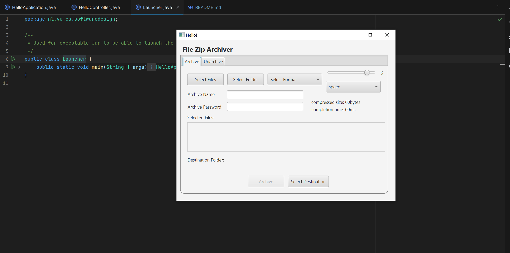

# File Archiver — Software Design (Java)

The aim of the file archiver is providing a system to manage archives of files on a machine. 
The key features include combining a number of files in one archive; supporting different formats of compression so as to optimize disk storage; easing navigation through a User Interface. The key functionalities include the creation of the archive, which allows users to create an archive that has a number of files; Compression, which gives the user different compression formats to achieve an optimal disk management; file management, which enables users to organize, edit and extract data from the archive.

## Demo

Below are some screenshot of the File Archiver application in action:

## Publication

- Title: File Archiver — Software design in Java  
- Type: Technical Report · August 2025  
- DOI: 10.13140/RG.2.2.11833.28000
- https://doi.org/10.13140/RG.2.2.11833.28000
- ResearchGate: https://www.researchgate.net/publication/394249241

## Disclaimer

The work proposed here is published for training purposes. Please do not use\/distribute the code linked to the repository or the content of the report without the approval of its author.  

## Software

- Java\/Gradle  
- JavaFX SDK 22  

## Abstract

The aim of the file archiver is providing a system to manage archives of files on a machine. The key features include combining a number of files in one archive; supporting different formats of compression so as to optimize disk storage; easing navigation through a User Interface. The key functionalities include the creation of the archive, which allows users to create an archive that has a number of files; Compression, which gives the user different compression formats to achieve an optimal disk management; file management, which enables users to organize, edit and extract data from the archive.

## Keywords

User Interface, Friendly UI, compression, Encryption, AES encryption, GUI, Graphical User Interface.

## Features

1. Add files and folders to a new archive  
   - JavaFX file pickers and drag-and-drop  
   - Event handlers\/listeners for responsive selection  
   - Organized in Java collections  
   - Backend archiving via Deflater\/Inflater  
   - GUI-focused, user-centric flow

2. Extract archive content to a user-specified folder  
   - Buttons\/menus to trigger extraction  
   - Destination selection dialog  
   - Preserves directory structure  
   - Progress\/completion feedback

3. Password-based encryption during archive creation  
   - JavaFX password fields and validation  
   - AES via `javax.crypto` and `Cipher`  
   - Password strength via Regex; authentication with `PasswordAuthentication`

4. Explore archive contents without extracting  
   - Show names, sizes, modification dates  
   - Tree\/breadcrumb navigation  
   - Selective extraction of entries  
   - Real-time UI feedback

5. Multiple compression formats  
   - Format selection via combo boxes  
   - Default ZIP; extensible to TAR, 7Z, GZIP, LZO, BZIP2  
   - Modular architecture via interfaces\/abstract classes

6. Basic per-format configurations  
   - Sliders\/dropdowns for format options  
   - Adjust compression level\/algorithm for speed vs. size  
   - Preview time\/size estimates  
   - Persist preferences via `java.util.prefs`

## Design Overview

- Packages: File Archiver (Create\/Extract\/Explore), Compression Formats (via `Compressible`), Security (Encryption\/Decryption), and Elements (File\/Folder).  
- Services: `ArchiveService` handles business logic, factory methods, recursive directory handling, extraction, and entry enumeration.  
- Patterns: Composite (Element\/File\/Directory), Factory, and SRP for `EncryptionMethod` implementing `Encryptable`.  
- UI: `HelloApplication` and `HelloController` (JavaFX) manage user interactions, selection, formatting, progress, and validation.  
- Utilities: `FileUtils` and `CompressionData` compute sizes, times, and metadata for display.

## Logic

### Archive creation (class ArchiveService)
The archive lifecycle starts in an Empty state, progresses through an Incomplete submachine state where name, elements, and destination are set concurrently, and reaches Complete when all guards are satisfied. From Complete, the system bundles and compresses the archive, or returns to Incomplete/Empty for edits or a new build. Extraction transitions from Compressed back to Complete when decryption succeeds.
Figure 4: State machine 1: Archive creation (class ArchiveService)

### Encryption (class EncryptionMethod)
After files are selected and compressed, the system evaluates whether a password is provided. If `password.isEmpty()` is true, the process transitions to the Unencrypted state; otherwise, it moves to an intermediate Unsecure state, where `checkPasswordStrength()` is invoked. A weak password halts encryption, whereas a valid one transitions the process to the Encrypted state, where the archive is secured using the user’s password. Decryption is possible through the `decrypt()` method. If the entered password matches the original key, the archive moves to the Unencrypted state and, upon an `extractArchive` event, reaches the Complete state. If the password is weak, the user must provide a stronger one before encryption can proceed.
Figure 5: State machine 2: Encryption (class EncryptionMethod)

### Archiving files and encryption
The user selects files via the GUI, which asks the backend to validate them. An alt branch handles:
- [Invalid files] notify the user that files cannot be archived.
- [Valid files] the user selects a compression format and confirms.
  On confirmation, the Archiver:
1. Compresses the selected files with the chosen algorithm.
2. Optionally encrypts the resulting archive.
   The system outputs the final archive and notifies on success.
   Figure 6: Sequence diagram 1: Archiving files and encryption

### Extracting files and decryption
The user selects an archive and provides a decryption key. An alt branch handles:
- [Invalid key] show failure and prompt for a new key.
- [Valid key] await confirmation.
  On confirmation, the system decrypts and extracts the files and notifies on completion.
  Figure 7: Sequence diagram 2: Extracting files and decryption

## Software Design Patterns

### Factory Method Pattern
- Problem. Support multiple formats (ZIP, TAR, Gzip, etc.) without tight coupling; adding formats should be easy.
- Solution. Define `Compressible` with `compress()`, `decompress()`, and `pathExtension()`. Implement concrete classes (e.g., `ZipCompression`, `TarCompression`).
- Intended Use. At runtime, a factory returns the correct handler based on user selection.
- Constraints. Slight boilerplate increase from abstraction.
- Additional Remarks. Effective for related classes sharing common methods with format\-specific behavior.

### Dependency Injection Pattern
- Problem. Avoid tight coupling in `ArchiveService` across formats and operations like `createGzipArchive()` or `create7zArchive()`.
- Solution. Delegate dependency creation to an external orchestrator. `HelloController` interprets user choices and injects dependencies into `ArchiveService`.
- Intended Use. User picks options in the GUI; `HelloController` forwards to `ArchiveService`.
- Constraints. Minor boilerplate increase.
- Additional Remarks. Improves testability, extensibility, and modularity.

### Observer Pattern
- Problem. Directly wiring GUI controls to logic creates tight coupling and fragile code.
- Solution. Use observers via event handlers (e.g., `onAction=#handleSelectFiles`, `onAction=#handleArchive`) that notify controllers/services.
- Intended Use. User actions trigger observers in `HelloController` or `ArchiveService` to perform compression/extraction.
- Constraints. None significant.
- Additional Remarks. Decouples UI from logic, easing changes and reducing cascading effects.

## Conclusion
The File Archiver’s development focused on a clean separation between GUI and core logic, implemented via `HelloController`/FXML and `ArchiveService`, respectively, and supported by JavaFX setup (FXCollections, ObservableList, DirectoryChooser, Application). Features were implemented incrementally: Feature 1 (add files/folders) and parts of Feature 4 (explore without extraction) first; then Feature 2 (extraction), Feature 5 (multiple formats), and Feature 6 (per\-format configs). This validated the `Compressible` interface and the Factory Method pattern by adding six concrete compression classes implementing only `compress()` and `decompress()`. `FileUtils` enabled metadata inspection to complete Feature 4. Feature 3 (password\-based encryption) was integrated via `Encryption` implementing `Encryptable`, leveraging `javax.crypto`, `java.security`, `Cipher`, and AES. The Strategy approach around `Encryptable` preserves extensibility for future encryption methods. Overall, Factory Method, Observer, and Strategy patterns, along with DI, deliver a modular, maintainable system ready for extension.
